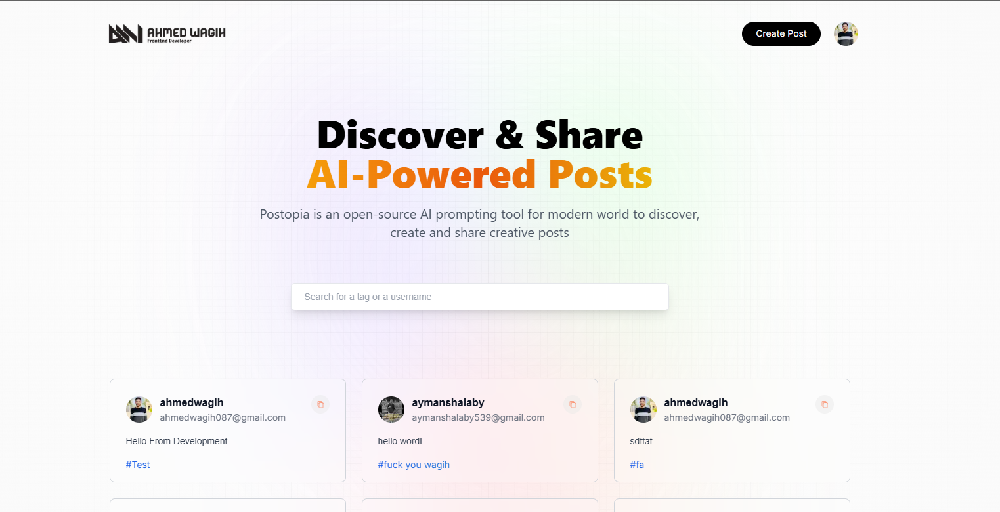

<!-- This is a [Next.js](https://nextjs.org/) project bootstrapped with [`create-next-app`](https://github.com/vercel/next.js/tree/canary/packages/create-next-app). -->



⚙️ Tech Stack
Next.js
MongoDB
NextAuth
TailwindCSS

🔋 Features
👉 Modern Design with Glassmorphism Trend Style: A modern and visually appealing design, incorporating the glassmorphism trend style for a sleek and contemporary appearance.

👉 Discover and Share AI Prompts: Allow users to discover AI prompts shared by the community and create their own prompts to share with the world.

👉 Edit and Delete Created Prompts: Users have the ability to edit their created prompts at any time and delete them when needed.

👉 Profile Page: Each user gets a dedicated profile page showcasing all the prompts they've created, providing an overview of their contributions.

👉 View Other People's Profiles: Users can explore the profiles of other creators to view the prompts they've shared, fostering a sense of community.

👉 Copy to Clipboard: Implement a convenient "Copy to Clipboard" functionality for users to easily copy the AI prompts for their use.

👉 Search Prompts by Specific Tag: Allow users to search for prompts based on specific tags, making it easier to find prompts related to specific topics.

👉 Google Authentication using NextAuth: Enable secure Google authentication using NextAuth, ensuring a streamlined and trustworthy login experience.

👉 Responsive Website: Develop a fully responsive website to ensure optimal user experience across various devices, from desktops to smartphones

and many more, including code architecture and reusability

## Getting Started

First, run the development server:

```bash
npm run dev
# or
yarn dev
# or
pnpm dev
# or
bun dev
```

Open [http://localhost:3000](http://localhost:3000) with your browser to see the result.

You can start editing the page by modifying `app/page.js`. The page auto-updates as you edit the file.

This project uses [`next/font`](https://nextjs.org/docs/basic-features/font-optimization) to automatically optimize and load Inter, a custom Google Font.

## Learn More

To learn more about Next.js, take a look at the following resources:

- [Next.js Documentation](https://nextjs.org/docs) - learn about Next.js features and API.
- [Learn Next.js](https://nextjs.org/learn) - an interactive Next.js tutorial.

You can check out [the Next.js GitHub repository](https://github.com/vercel/next.js/) - your feedback and contributions are welcome!

## Deploy on Vercel

The easiest way to deploy your Next.js app is to use the [Vercel Platform](https://vercel.com/new?utm_medium=default-template&filter=next.js&utm_source=create-next-app&utm_campaign=create-next-app-readme) from the creators of Next.js.

Check out our [Next.js deployment documentation](https://nextjs.org/docs/deployment) for more details.
